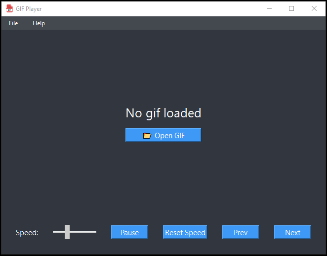

# PySide6 GIF Player

A lightweight desktop app for viewing animated GIFs, built with PySide6.

## Features

- Play/pause animated GIFs.
- Next/previous navigation to cycle through GIFs in same folder.
- Control playback speed, including a reset-to-default button.
- Dynamically scale GIFs when resizing the window — preserves original aspect ratio.
- Can be set as the default program for opening `.gif` files.


## Screenshot



## Installation

- Clone the repository.
- Open the project in your preferred IDE.
- Install the required packages.
- Run the app by launching main.py

## Packaging
To build a standalone executable using PyInstaller, first make sure it is installed.
Run with the following command from the project folder:

Windows(Tested):
```
pyinstaller --name=GIFPlayer --onefile --noconsole --icon="icons/gif-icon.ico" --add-data "icons/*.ico;icons" --add-data "layout/*.py;layout" main.py

```

Linux(Tested)/Mac(Not tested)

```
pyinstaller --name=GIFPlayer --onefile --windowed --icon=icons/gif-icon.png --add-data "icons/*.ico:icons" --add-data "layout/*.py:layout" main.py
```

## Icon Attribution
The GIF file icon used in this project was sourced from [UXWing](https://uxwing.com/file-gif-color-red-icon/). Thank you!